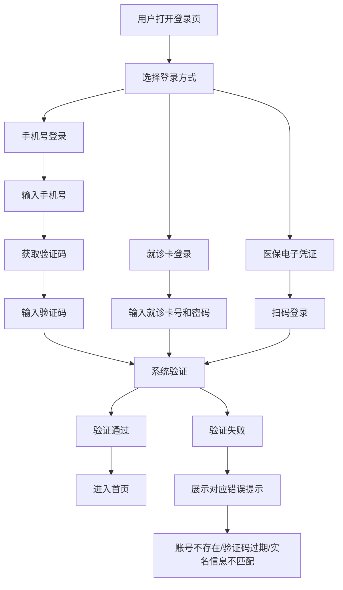

## 1. 产品概述
医院预约挂号系统登录页，为患者提供便捷的登录入口。
- 支持多种登录方式：手机号验证码、就诊卡、医保电子凭证，覆盖不同患者群体
- 提供老年人模式，提升老年患者使用体验
- 页面内置快捷入口提示：当日号源查询、报告查询、儿童账号绑定

## 2. 核心功能

### 2.1 用户角色
| 角色 | 注册方式 | 核心权限 |
|------|----------|----------|
| 患者用户 | 手机号/就诊卡/医保电子凭证注册 | 预约挂号、查询报告、管理账号 |

### 2.2 功能模块
1. **登录页**：登录方式切换、表单输入、老年人模式、快捷入口提示、错误提示

### 2.3 页面详情
| 页面名称 | 模块名称 | 功能描述 |
|----------|----------|----------|
| 登录页 | 登录方式切换 | Tab切换手机号、就诊卡、医保电子凭证三种登录方式 |
| 登录页 | 手机号登录 | 输入手机号、获取验证码、输入验证码登录 |
| 登录页 | 就诊卡登录 | 输入就诊卡号和密码登录 |
| 登录页 | 医保电子凭证 | 扫码登录入口及说明 |
| 登录页 | 老年人模式 | 一键切换大字体、大按钮模式 |
| 登录页 | 快捷入口 | 当日号源、报告查询、儿童账号绑定提示入口 |
| 登录页 | 错误提示 | 区分账号不存在、验证码过期、实名信息不匹配等错误 |

## 3. 核心流程
用户打开登录页 → 选择登录方式（手机号/就诊卡/医保电子凭证） → 填写对应信息 → 系统验证 → 验证成功进入主页 / 验证失败展示对应错误提示

## 4. 用户界面设计
### 4.1 设计风格
- 主色调：医疗蓝 (#0EA5E9)，辅助色：健康绿 (#10B981)，警示色：温暖橙 (#F97316)
- 按钮风格：圆角大按钮，带有微妙阴影，hover状态有轻微上浮效果
- 字体：使用思源黑体（Noto Sans SC），清晰易读
- 布局风格：居中卡片式布局，左侧品牌展示区，右侧登录表单区
- 图标风格：使用Lucide图标库，线性简洁风格

### 4.2 页面设计概述
| 页面名称 | 模块名称 | UI元素 |
|----------|----------|--------|
| 登录页 | 品牌展示区 | 医院Logo、欢迎标题、装饰性医疗图标动效、渐变色背景 |
| 登录页 | 登录方式Tab | 三种登录方式切换，选中状态有下划线动画 |
| 登录页 | 表单区域 | 输入框带图标、获取验证码倒计时按钮、登录主按钮 |
| 登录页 | 老年人模式 | 右上角切换开关，开启后全局放大 |
| 登录页 | 快捷入口 | 底部三个卡片式入口，带图标和说明 |
| 登录页 | 错误提示 | 输入框边框变红，下方展示对应错误文案 |

### 4.3 响应性
桌面端优先设计，左右分栏布局；移动端自适应为上下布局，确保触摸操作友好。
