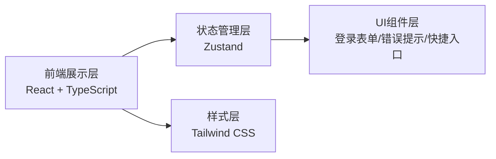

## 1. 架构设计


## 2. 技术描述
- 前端：React@18 + TypeScript + Tailwind CSS@3 + Vite
- 初始化工具：Vite-init
- 后端：无（纯前端演示，使用模拟数据）
- 状态管理：Zustand
- 图标库：lucide-react
- 路由：react-router-dom

## 3. 路由定义
| 路由 | 用途 |
|------|------|
| /login | 登录页面 |
| / | 首页（登录成功后跳转，暂为占位页） |

## 4. 数据模型
### 4.1 登录表单数据类型
```typescript
// 手机号登录表单
interface PhoneLoginForm {
  phone: string;
  code: string;
}

// 就诊卡登录表单
interface CardLoginForm {
  cardNumber: string;
  password: string;
}

// 登录方式
type LoginMethod = 'phone' | 'card' | 'insurance';

// 错误类型
type ErrorType = 
  | 'account_not_found' 
  | 'code_expired' 
  | 'realname_mismatch' 
  | 'network_error'
  | null;
```
